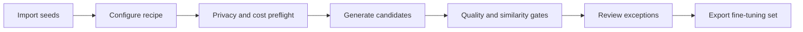

# Dataset Foundry

Turn a small seed set into reviewable, fine-tuning-ready data.

Dataset Foundry is a local-first synthetic data generation pipeline for teams that need more than a
prompt and a JSON file. It imports representative seed examples, generates bounded candidate
batches with OpenAI, Anthropic, or a deterministic offline provider, explains every quality
decision, keeps human review auditable, and writes immutable JSONL and Parquet exports.


## What it solves

- **Structured generation:** native Pydantic structured output for both live provider adapters.
- **Scale without runaway work:** target, candidate, call, concurrency, retry, and token preflight.
- **Diversity with evidence:** vector nearest-match filtering against seeds and accepted candidates.
- **Reviewable quality:** component scores, reason codes, nearest matches, and preserved overrides.
- **Fine-tuning delivery:** canonical, OpenAI chat, Alpaca, and grouped Parquet splits with hashes.
- **Key-free evaluation:** the full workflow runs offline and deterministically for demos and CI.

## Quick start

```bash
uv sync --frozen
npm --prefix frontend ci
npm --prefix frontend run build
uv run dataset-foundry demo
uv run dataset-foundry serve
```

Open [http://127.0.0.1:8765](http://127.0.0.1:8765). Start `uv run dataset-foundry worker` in a
second terminal when you want queued runs to continue processing.

The demo provider makes no network calls and requires no API key. See the
[getting-started guide](docs/getting-started.md) for live-provider and frontend-development setup.

## The workflow



The workbench is deliberately organized like a data operations product—Projects, Generate, Runs,
Review, and Exports. Provider traces, prompt hashes, embedding fingerprints, and component evidence
stay available under Details without becoming the default navigation model.

## Provider modes

| Provider | Intended use | Network | Structured output |
|---|---|---:|---|
| `offline` | demos, CI, scale and air-gapped evaluation | No | Pydantic objects produced locally |
| `openai` | live synthetic generation | Yes | Responses API with Pydantic parsing |
| `anthropic` | live synthetic generation | Yes | Messages API with Pydantic parsing |

Live runs require a server-side credential and an explicit external-data-transfer confirmation.
Dataset Foundry never silently replaces a paid provider with offline output.

## Quality and diversity

Every candidate passes canonical message validation, exact-duplicate normalization, vector
nearest-match checks, and explainable components covering completeness, useful length, relevance,
lexical richness, boilerplate, seed novelty, accepted-pool diversity, and configured constraints.

The built-in `lexical-hash-v1` embedder produces real normalized vectors without downloading a
model. It is clearly labeled lexical rather than semantic. Embedding fingerprints prevent vectors
from different models or dimensions from being compared.

Read [quality methodology](docs/quality-methodology.md) for the decision and split-leakage contract.

## Exports

Completed runs can produce:

- canonical chat JSONL;
- OpenAI chat fine-tuning JSONL;
- Alpaca-style instruction/input/output JSONL; and
- train/validation/test Parquet shards.

Related examples are grouped by root seed before splitting. Each export includes a dataset card and
manifest with thresholds, provenance, actual split counts, byte sizes, and SHA-256 hashes.

## Architecture

FastAPI is the only product data boundary. A separate SQLite-leased worker generates and scores
candidates outside the HTTP lifecycle; the React workbench and CLI consume the same API. SQLite is
the local transactional source of truth, and exports are staged then atomically promoted beneath
`.data/artifacts/`.

See [architecture](docs/architecture.md) and the [API reference](docs/api.md).

## Validation

```bash
make check
make benchmark-ci
make e2e
```

- Pytest owns Python unit, integration, contract, and scale tests.
- Cypress owns React component tests only.
- Playwright owns all end-to-end tests.
- Live-provider smoke tests are separately opted in and never part of an offline-green claim.

The current local, mocked-provider, browser, live-provider, and hosted proof boundaries are recorded
in [the build completion record](docs/dataset-foundry/2026-07-18-build-completion.md).

## Documentation

- [Getting started](docs/getting-started.md)
- [Architecture](docs/architecture.md)
- [Generation methodology](docs/generation-methodology.md)
- [Quality methodology](docs/quality-methodology.md)
- [API reference](docs/api.md)
- [Operations](docs/operations.md)
- [Security model](docs/security.md)
- [Extending Dataset Foundry](docs/extending.md)
- [Troubleshooting](docs/troubleshooting.md)

## License

MIT
