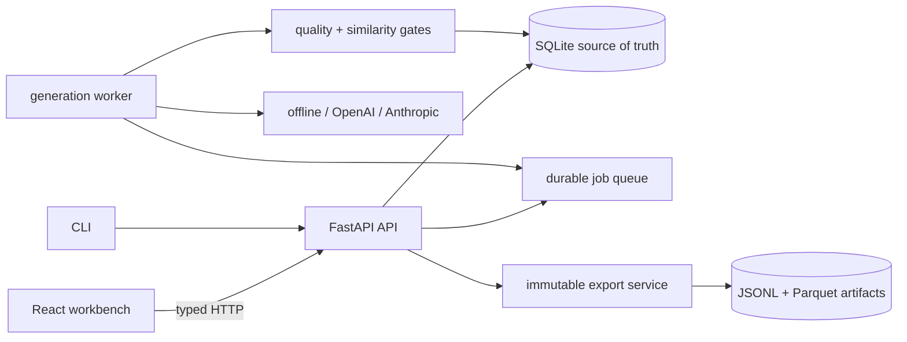

# Architecture

Dataset Foundry is a local-first data operations application. The browser never opens SQLite,
Parquet files, or provider SDKs directly; the FastAPI service is the only product data boundary.

## System map

The API and worker can run in one local checkout or as separate containers sharing a data volume.
SQLite uses a single-writer operating posture; a multi-host deployment should replace the queue and
database with infrastructure designed for distributed workers.

## Core flow

1. Ingestion normalizes JSON, JSONL, CSV, or Parquet into canonical chat examples.
2. A recipe captures the target count, provider, model, budgets, thresholds, random seed, and
   diversity constraints.
3. Preflight calculates the maximum candidate and call budget and blocks live providers until the
   caller explicitly approves external data transfer.
4. The API persists a queued run; a worker claims it with a time-bounded lease.
5. The provider returns a Pydantic-validated candidate batch.
6. Every candidate receives a stable fingerprint, explainable component scores, and a nearest-match
   similarity check against seeds and already accepted candidates.
7. Accepted, rejected, and needs-review candidates are all retained. Human review creates an audit
   record and never rewrites the original automated decision.
8. Export takes an immutable snapshot, groups related examples before splitting, writes files
   atomically, and hashes every artifact in a manifest.

## Canonical contracts

`TrainingExample` is the provider-neutral record. It contains either:

- `user → assistant`, or
- `system → user → assistant`

Imported `instruction/input/output` and `prompt/completion` rows are mapped into that contract.
Generation providers return `CandidateBatch`; they cannot add undeclared fields because every
domain model uses Pydantic's strict extra-field rejection.

`GenerationRecipe` bounds the expensive parts of a run: target count, batch size, candidate
multiplier, concurrency, retries, and live-provider consent. `QualityReport` holds the aggregate,
component results, reason codes, nearest-match evidence, and both automated and reviewed decisions.
`ExportManifest` records data and recipe fingerprints, thresholds, provider/model provenance,
actual split counts, artifact hashes, and sizes.

## Durable jobs

Generation does not run inside an HTTP request. A queued job stores its lease owner, expiration, and
heartbeat. A worker claims one job atomically, heartbeats during long work, fences writes by lease
owner, and allows expired work to be recovered. Candidate uniqueness is enforced per run so a
recovered batch cannot create duplicate accepted rows.

Terminal run states are `completed`, `failed`, and `cancelled`. A completed run is not reopened;
users create a new recipe/run so provenance remains unambiguous.

## Frontend boundary

The React workbench uses TanStack Query for typed server state. Independent dashboard queries start
in parallel, only active runs poll, and mutations invalidate the smallest relevant query set.
Provider keys never appear in browser configuration. Technical evidence—raw prompt version,
fingerprints, trace IDs, and score components—lives behind explicit Details controls so the default
experience remains a familiar data workflow.

## Storage

- SQLite is the transactional source of truth for projects, datasets, recipes, runs, jobs,
  candidates, quality decisions, reviews, exports, and audit events.
- `.data/artifacts/<export-id>/` contains immutable adopter-facing artifacts.
- A completed export directory is never overwritten.
- Temporary output is written beside the destination and renamed only after all files and the
  manifest validate.

## Operating boundaries

- **Offline:** deterministic templates and lexical hash embeddings; no network calls.
- **Mocked provider:** adapter contracts exercised against test doubles; no provider quality claim.
- **Live provider:** explicit opt-in, credential, data-transfer approval, and bounded budget.
- **Local browser:** proves the app and local API/worker path only.
- **Hosted:** requires separate deployment and hosted readback evidence.

These layers must be reported separately. A green offline demo does not imply a live-provider or
hosted deployment passed.

