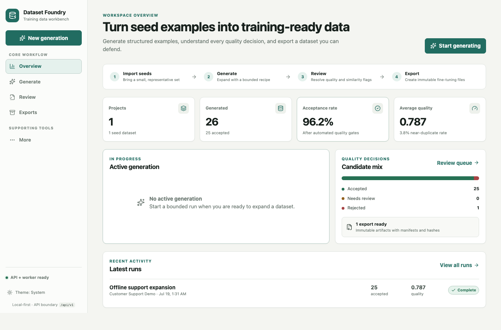

# Dataset Foundry build completion

Date: 2026-07-18
Repository: /Users/fortunevieyra/Documents/Github/ai-projects/dataset-foundry
Branch: main
Scope: complete local-first synthetic-data generation product

## Outcome

Dataset Foundry is complete as a source and Docker-distributed application. It imports canonical
seed datasets, creates bounded generation recipes, generates with a deterministic offline provider
or structured OpenAI/Anthropic adapters, filters candidates with explainable quality and embedding
similarity checks, persists review decisions, and creates immutable JSONL and Parquet exports.

The React workbench exposes Projects, Generate, Runs, Review, Exports, and Settings through the
FastAPI boundary. Review pages use server-side decision filters and cursor pagination, include the
actual referenced seed text, and preserve quality components, similarity evidence, lineage, and
provider provenance.

## Delivered architecture

- Python 3.11+ package with FastAPI, Pydantic v2, SQLAlchemy, SQLite, PyArrow, Typer, and Uvicorn.
- React 19 + TypeScript + Vite + TanStack Query workbench.
- Deterministic offline provider for key-free demos, CI, and repeatable scale proof.
- OpenAI Responses structured-output and Anthropic structured-output adapters.
- Durable SQLite queue with claim tokens, lease epochs, periodic renewal, retries, recovery, and
  cancellation on lease loss.
- JSON, JSONL, CSV, and Parquet seed ingestion with canonicalization, semantic deduplication,
  fingerprints, and duplicate readback.
- Explainable quality scoring plus lexical-hash normalized vector similarity against seeds and
  accepted candidates.
- Human review with atomic decision, quality-report, audit-event, and run-count persistence.
- Immutable canonical JSONL, OpenAI chat JSONL, Alpaca JSONL, and grouped Parquet split exports with
  dataset cards, manifests, sizes, and SHA-256 hashes.
- Multi-stage non-root Docker image with a read-only filesystem, dropped capabilities, localhost
  port binding, health checks, persistent data volume, and separately running API and worker.

## Important integrity behavior

- Provider-authored structured output is limited to candidate messages and source lineage. IDs,
  metadata, traces, fingerprints, and provenance are server-owned.
- Blank credentials normalize to absent values and cannot bypass authentication.
- Container loopback authentication bypass is disabled by default and must be explicitly enabled;
  Compose enables it only while publishing to host 127.0.0.1.
- Recipe idempotency uses semantic content rather than generated IDs or timestamps.
- Generation over more than 100 seeds uses deterministic stratified batch rotation.
- Candidate diversity is checked against accepted candidates from prior batches and the current
  batch.
- Seed deduplication preserves the first canonical row and records duplicate_count.
- Export splits use transitive connected components across every source seed ID to prevent lineage
  leakage.
- Export name, selected formats, and requested train/validation/test ratios are persisted and
  honored.

## Validation results

### Source and automated tests

- make check: passed.
- Backend: 69 passed, 1 paid-provider live test deselected, 82.24% branch-aware coverage.
- Ruff: passed; 68 Python files formatted.
- Strict mypy: passed.
- Cypress component tests: 4/4 passed. Cypress is component-only.
- Playwright E2E: 4/4 passed across primary generation, review/export, provenance/themes, and
  desktop/tablet/mobile overflow checks.
- Wheel and source distribution: built successfully.
- Fresh-wheel smoke: version 0.1.0 imported, FastAPI application created, and CLI commands loaded.

### Security and dependency gates

- Bandit: passed.
- pip-audit: no known third-party vulnerabilities; the unpublished local package is intentionally
  not on PyPI.
- npm audit at moderate severity: zero vulnerabilities.
- Docker Compose configuration: valid.
- Stale placeholder/model/Cypress-E2E scan: no matches.

### Scale proof

The in-memory quality-kernel benchmark and the complete durable benchmark are separate proof
layers.

- Quality kernel, 2,000 generated: 1,418 accepted and exported, 582 rejected, 4.9819 seconds,
  401.45 examples/second, 65.67 MiB peak.
- Durable workflow, target 250: 260 generated, 250 accepted and exported, 10 rejected,
  2.7883 seconds, 89.66 accepted examples/second, 12.18 MiB peak.
- Durable workflow, target 2,000: 3,367 generated, 2,000 accepted and exported, 1,367 rejected,
  40.4935 seconds, 49.39 accepted examples/second, 97.22 MiB peak.

The durable benchmark exercises SQLite persistence, queue claim and worker execution, quality
filtering, accepted-target completion, and immutable export creation. It is the relevant proof for
the user's thousands-of-examples goal.

### Rendered and container proof

- The final multi-stage image built successfully.
- API and worker recreated from the final image.
- API container reported healthy; /health returned version 0.1.0 and /ready confirmed the database.
- The offline container demo created 25 accepted examples and an immutable export.
- The live local workbench read 1 project, 26 generated candidates, 25 accepted candidates,
  96.2% acceptance, and two exports.
- Browser proof covered overview, accepted-candidate evidence, actual source seed content,
  export history, custom export creation, API-backed settings, mobile navigation, and light/dark
  themes.
- Browser console warnings and errors: none.
- Custom export readback: Container canonical snapshot, canonical_jsonl only, 80/10/10 requested
  split ratios, ready status, 25 examples.

## Evidence boundaries

- Confirmed: source, unit/integration/contract/scale tests, wheel installation, local browser,
  local Docker image, container API/worker health, offline generation, persistence, and export
  readback.
- Contract-tested but not live-called: OpenAI and Anthropic adapters. Provider clients were mocked;
  no paid API request was authorized or made.
- Not performed: hosted-dev or production deployment. No deployment target or git remote is
  configured.
- The source tree and Docker image include the full workbench. The standalone Python wheel is a
  backend/CLI artifact and does not embed the separately built React assets.

## Commits

- 4b97eef feat: build synthetic generation pipeline
- a29fb8d feat: add Dataset Foundry workbench
- f0c8e6e build: add release and operations gates

Initial scaffold: f0da60a. A later documentation commit adds this completion record and the handoff.

## Start and operate

From /Users/fortunevieyra/Documents/Github/ai-projects/dataset-foundry:

    uv sync --frozen
    npm --prefix frontend ci
    npm --prefix frontend run build
    uv run dataset-foundry demo
    uv run dataset-foundry serve

For the production-like local package:

    docker compose up -d --build
    docker compose ps
    docker compose down

For validation:

    make check
    make e2e
    make security
    make benchmark-durable

Execution-oriented Codex sessions must run these through the home secret-safe wrapper and preserve
the repository's Cypress-component-only and Playwright-E2E policies.

## Remaining proof and optional expansion

- Run the one-call paid-provider smoke only with operator-approved credentials, provider allowlist,
  seed hash, and DATASET_FOUNDRY_RUN_LIVE_TESTS=1.
- Choose a hosting target and authenticate a remote before claiming hosted or production proof.
- If the Python wheel becomes a user-facing distribution, add a frontend build hook and wheel-root
  UI smoke; Docker is currently the full product distribution.
- A future Argilla or distilabel connector remains optional and must consume the existing review
  and export contracts rather than bypassing audit persistence.
- Track the upstream Starlette TestClient/httpx2 migration warning; it does not affect runtime.

## Durable handoff

Canonical continuation package:
/Users/fortunevieyra/Documents/Github/beladed.com/docs/handoffs/2026-07-18-codex-dataset-foundry-complete.handoff.mdc
